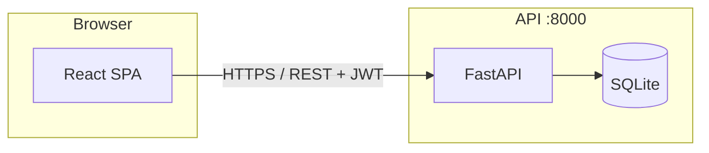

# Task Management App


A full-stack task management application with a **React** frontend and **FastAPI** backend. Users can register, sign in, and manage personal tasks with filtering, optimistic updates, and a responsive UI.

Built as a portfolio project to demonstrate end-to-end product development: secure APIs, modern frontend patterns, automated testing, and Docker-based deployment.

---

## Features

### Application
- User registration and JWT authentication (persistent sessions)
- Create, read, update, and delete tasks
- Dashboard with stats, search, and status filters (all / active / completed)
- Toggle task completion from the dashboard
- Protected routes and guest-only auth pages
- Empty, loading, and error states with retry
- Responsive layout and dark mode (system preference)

### Backend
- REST API with OpenAPI docs (`/docs`)
- User-scoped tasks (authorization per owner)
- SQLAlchemy models and Alembic migrations
- Pytest test suite

### Frontend
- React 19 + TypeScript + Vite + Tailwind CSS
- Axios API client with JWT interceptors
- Accessible UI (skip link, ARIA, keyboard filter controls)

---

## Tech Stack

| Layer | Technologies |
|-------|----------------|
| **Frontend** | React, TypeScript, Vite, Tailwind CSS, React Router, Axios |
| **Backend** | Python 3.12, FastAPI, SQLAlchemy, Alembic, Pydantic |
| **Auth** | JWT (python-jose), bcrypt via passlib |
| **Database** | SQLite (local / Docker); PostgreSQL-ready via `DATABASE_URL` |
| **Deploy** | Docker, Docker Compose, Nginx |
| **CI** | GitHub Actions (tests, frontend build, Docker build) |

---

## Architecture



In production, the static frontend is served by **Nginx**; the API runs as a separate service. See [DEPLOYMENT.md](DEPLOYMENT.md) for details.

---

## Project Structure

```
task-management-api/
├── app/                 # FastAPI application
│   ├── main.py          # Routes and CORS
│   ├── models.py        # SQLAlchemy models
│   ├── schemas.py       # Pydantic schemas
│   ├── auth.py          # JWT and passwords
│   ├── crud.py          # Database operations
│   └── deps.py          # Dependencies
├── frontend/            # React SPA
│   └── src/
│       ├── api/         # Axios client and endpoints
│       ├── components/  # UI and layout
│       ├── contexts/    # Auth state
│       ├── hooks/       # Data fetching hooks
│       ├── pages/       # Route pages
│       └── routes/      # Router and guards
├── tests/               # Backend pytest suite
├── alembic/             # Database migrations
├── docker-compose.yml   # Full-stack local deploy
├── Dockerfile           # API image
└── DEPLOYMENT.md        # Production deployment guide
```

---

## Quick Start (Docker)

The fastest way to run the full stack:

```bash
git clone https://github.com/DChahbar/task-management-api.git
cd task-management-api
cp .env.docker.example .env
# Edit .env — set a strong SECRET_KEY
docker compose up --build
```

| URL | Description |
|-----|-------------|
| http://localhost:8080 | Web app |
| http://localhost:8000/docs | API documentation |
| http://localhost:8000/health | Health check |

Stop with `docker compose down`.

---

## Local Development

Run the API and frontend separately for day-to-day development.

### Backend

```bash
python -m venv .venv

# Windows
.venv\Scripts\activate
# macOS / Linux
source .venv/bin/activate

pip install -r requirements.txt
cp .env.example .env
alembic upgrade head
uvicorn app.main:app --reload
```

API: http://127.0.0.1:8000  
Docs: http://127.0.0.1:8000/docs

### Frontend

```bash
cd frontend
npm install
cp .env.example .env
npm run dev
```

App: http://localhost:5173

Ensure `VITE_API_URL` in `frontend/.env` points to the API (default `http://127.0.0.1:8000`).

---

## API Overview

| Method | Endpoint | Auth | Description |
|--------|----------|------|-------------|
| `POST` | `/auth/register` | No | Create account |
| `POST` | `/auth/login` | No | OAuth2 form login → JWT |
| `GET` | `/tasks` | Bearer | List current user's tasks |
| `POST` | `/tasks` | Bearer | Create task |
| `GET` | `/tasks/{id}` | Bearer | Get one task |
| `PATCH` | `/tasks/{id}` | Bearer | Update task |
| `DELETE` | `/tasks/{id}` | Bearer | Delete task |
| `GET` | `/health` | No | Health check |

---

## Running Tests

**Backend** (from repo root):

```bash
pytest -q
```

**Frontend** (build check):

```bash
cd frontend
npm ci
npm run build
```

CI runs both, plus `docker compose build`, on every push to `main`.

---

## Deployment

For production builds, environment variables, and hosting options, see **[DEPLOYMENT.md](DEPLOYMENT.md)**.

Summary:
- Build the frontend with `VITE_API_URL` set to your public API URL
- Configure `SECRET_KEY` and `CORS_ORIGINS` on the API
- Use `requirements-prod.txt` for lean API installs

---

## Why This Project

This project demonstrates skills employers look for in full-stack and backend roles:

- Designing and consuming REST APIs
- Secure authentication and per-user authorization
- Modern React architecture (routing, context, hooks, TypeScript)
- Thoughtful UX (loading, errors, accessibility, responsive UI)
- Database migrations and automated tests
- Containerized deployment ready for demos and interviews

---

## Contact

**Darwish Chahbar**  
Email: [chahbar.darwish@gmail.com](mailto:chahbar.darwish@gmail.com)  
GitHub: [github.com/DChahbar](https://github.com/DChahbar)
